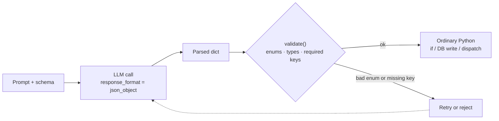

# 01 · Structured / Constrained Output

## What it is
One call, but the output is forced into a schema (JSON, or a Pydantic model) instead of prose.
It's the adapter that lets an LLM sit inside ordinary deterministic code.

*JSON mode guarantees parseable JSON, not **your** schema — which is why the diamond exists.*

## When to reach for it
Any time the model's answer feeds an `if`, a database write, or another function — extraction,
classification, form filling, "turn this email into a record." **Also a sub-component of almost
every other topology here**: routers classify with it, planners emit plans with it, judges emit
scores with it. If you internalize one pattern from this repo, make it this one.

Trigger phrases: *"extract"*, *"parse"*, *"classify into"*, *"turn X into a record/row/ticket"*.

**Grounded examples**
- **Receipt and invoice capture** (Expensify, Ramp, Brex) — a photo becomes
  `{merchant, amount, currency, date, category}` and posts straight to a ledger. The row is the
  product; prose would be useless.
- **Résumé parsing in an ATS** (Greenhouse, Lever) — free-form CVs become typed candidate records
  so recruiters can filter by years of experience and skills.
- **Support ticket triage fields** — every inbound email gets `urgency`, `category`, `sentiment`
  written to Zendesk, which then fires the existing routing rules. The LLM feeds infrastructure that
  already exists rather than replacing it.
- **Log and alert enrichment** — turn a stack trace into `{service, error_class, likely_owner}` and
  page the right on-call.

## How it works
1. Describe the target shape in the system prompt (`main.py`) or as a Pydantic class (`main_typed.py`).
2. Call with `response_format={"type": "json_object"}` — or `client.chat.parse(response_format=Model)`.
3. `temperature=0`: extraction has one right answer.
4. **Validate anyway.** JSON mode guarantees *parseable JSON*, not *your schema*.

## Cost / latency / failure modes
1 call. The failure mode is a hallucinated enum value or a missing key — which is why `validate()`
exists in `main.py` and why the typed version is better: Pydantic rejects it for you. Second failure
mode is over-nesting: deep schemas degrade accuracy noticeably. Keep it flat, split into two calls
if you need more (see [02](../02-prompt-chaining/)).

## Two versions here
- `main.py` — raw JSON mode + manual validation. Portable to any provider.
- `main_typed.py` — `client.chat.parse()` with a Pydantic model. **Use this on Mistral.** Generation
  and validation in one call, and the schema can't drift from the type your code uses.

## Composes with
Everywhere. Notably [04-router](../04-router/) (the classify call), [09-plan-and-execute](../09-plan-and-execute/)
(the plan), [12-judge-and-guardrails](../12-judge-and-guardrails/) (the rubric score).
