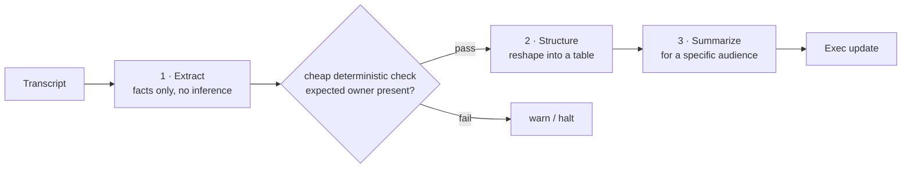

# 02 · Prompt Chaining

## What it is
Several LLM calls wired in a fixed sequence, where each call's output is the next call's input.
You author the control flow; the model never decides what happens next.

*Control flow is authored, not decided. The gate between steps is the free quality win.*

## When to reach for it
When one prompt is trying to do three jobs and doing all of them at 80%. Decompose into ordered
steps and each step gets simpler, more reliable, and independently testable. This is the *default*
answer for "process this document into that artifact" — reach for an agent only when the sequence
genuinely can't be known ahead of time.

Trigger phrases: *"take X and turn it into Y"*, *"first ... then ... finally"*, *"generate a report from"*.

**Grounded examples**
- **Meeting notes products** (Otter, Fireflies, Granola) — transcript → decisions and action items
  → owner/due-date table → a digest email. Four narrow steps, each independently checkable.
- **Contract review** — clause extraction → risk classification per clause → a client-facing memo.
  The middle step must never see the raw contract again, or it re-reads and re-hallucinates.
- **Localization pipelines** — translate → adapt idioms and units → verify against a terminology
  glossary. The glossary check is a deterministic gate between LLM steps.
- **Job description generation** — role intake form → competency list → the posting, with a
  bias-language check wedged in between.

## How it works
1. **Extract** — pull raw facts, explicitly forbidding inference.
2. **Structure** — reshape into a table. Only sees step 1's output, so it can't re-hallucinate.
3. **Summarize** — recompose for a specific audience.
4. Between steps, run cheap deterministic checks (the `if "Dana" not in table` line). Free quality gate.

## Cost / latency / failure modes
N calls, strictly serial — latency is the sum, so this is the slow topology. The characteristic
failure is **error propagation**: a bad step 1 quietly poisons everything downstream, and the final
output looks confident. Mitigate by printing intermediates (as here) and gating between steps.

## Composes with
[03-map-reduce](../03-map-reduce/) when a step needs to run over many inputs; [11-self-refine-critic](../11-self-refine-critic/)
to add a quality loop around any single step; [06-rag-advanced](../06-rag-advanced/) is itself a chain
(rewrite → retrieve → rerank → answer).
