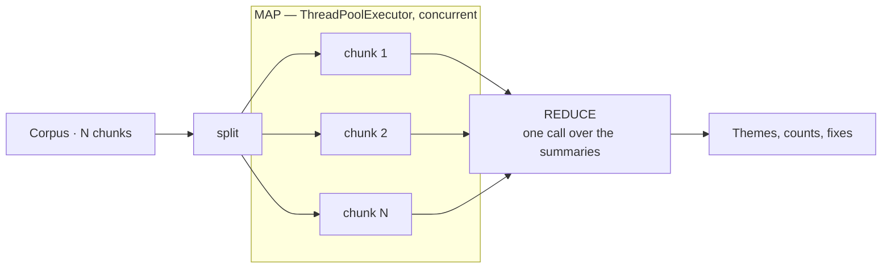

# 03 · Map-Reduce (Fan-out / Fan-in)

## What it is
Split the input into independent chunks, run the same prompt over each in parallel, then run one
aggregation call over the results. The parallel counterpart to [02](../02-prompt-chaining/).

*Wall-clock ≈ slowest map call + reduce. If the summaries also overflow, reduce as a tree.*

## When to reach for it
The corpus doesn't fit in a context window, or it does but you want the latency win, **and** the
per-chunk work is independent. This is the reflex answer for "summarize these 200 documents",
"pull every entity out of this codebase", "what are people complaining about across 10k reviews".

Trigger phrases: *"across all of these"*, *"for each file/review/ticket"*, *"summarize this 300-page"*.

**Grounded examples**
- **Earnings-call and 10-K summarization** — a 300-page filing chunked, each section summarized in
  parallel, then rolled into a one-page brief. Standard in finance research tooling.
- **App-store and NPS review mining** — 50k reviews in, a ranked list of themes with counts out.
  The demo in `main.py` is this at toy scale.
- **Codebase-wide analysis** — "which files touch PII?" run per file, aggregated into a report.
  Repo-wide linting and audit tools work this way because no context window holds a monorepo.
- **eDiscovery and document review** — every document in a legal production gets the same
  relevance prompt, and the reduce step produces the privilege log.

## How it works
1. Chunk the input (here: one review each; in practice, token-bounded slices with overlap).
2. **Map** — one narrow call per chunk, run through a `ThreadPoolExecutor`. The work is
   I/O-bound, so threads are correct; don't reach for asyncio unless you're already async.
3. **Reduce** — one call over the compressed outputs.
4. If the map outputs *themselves* overflow, reduce as a tree: reduce groups, then reduce the reductions.

## Cost / latency / failure modes
N+1 calls but wall-clock ≈ (slowest map call) + (reduce call). Watch for: **rate limits** (cap
`max_workers`, add backoff), **lost cross-chunk context** — a fact spanning two chunks is invisible
to both, which is why chunk overlap matters — and a **reduce step that silently truncates** when
N gets large.

## Cheaper alternative worth naming
If the map step is pure classification, `client.classifiers.classify()` does it without a generative
call at all — much faster and cheaper. Worth checking before you reach for a generative call.

## Composes with
[02-prompt-chaining](../02-prompt-chaining/) (map-reduce as one step of a chain);
[05-rag-naive](../05-rag-naive/) — retrieval is the alternative when you only need a *few* relevant
chunks rather than all of them. Choosing between them is a real design decision: RAG is cheap and
lossy, map-reduce is expensive and complete.
