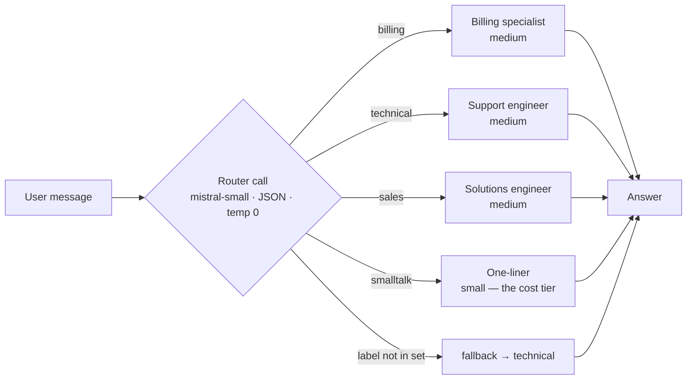

# 04 · Router / Dispatcher (+ model cascade)

## What it is
A cheap classification call picks which specialist prompt, model, or sub-chain handles the request.
The branch is decided by the model, but the *set of branches* is authored by you — so it stays bounded.

*Two wins in one pattern: each downstream context stays small, and easy queries get a cheap model.*

## When to reach for it
The moment your system prompt starts containing the word "if". A single prompt handling billing,
bugs, and sales does all three worse than three focused prompts. Also the cheapest reliability win
available: it keeps each downstream context small.

Trigger phrases: *"handle different kinds of"*, *"triage"*, *"support assistant"*, *"multi-domain"*,
*"we need to keep costs down"*.

**Grounded examples**
- **Support inbox triage** (Intercom Fin, Zendesk AI) — billing, bug, sales and "just saying
  thanks" each get a different prompt, a different tone, and different escalation rules.
- **Model cascade in consumer chat apps** — trivial turns go to a small fast model, hard ones
  escalate. At consumer volume this is the single largest cost lever available.
- **IDE assistants** — "explain this", "write a test", "refactor" and "find the bug" are four
  different system prompts behind one keyboard shortcut.
- **Banking and telecom IVR replacement** — route to balance-enquiry, dispute, or human, where
  sending a dispute down the balance path is a compliance problem, not just a bad answer.

## How it works
1. One call to a **small** model, JSON mode, temperature 0 — its only job is to emit a label.
2. Look the label up in a dispatch dict. **Always have a fallback** for an out-of-set label.
3. Run the specialist prompt, on the model that route deserves.
4. `smalltalk` routes to `mistral-small` — that's the **model cascade**: match model tier to task
   difficulty rather than paying top-tier for "thanks!".

## Cost / latency / failure modes
2 calls, but the first is tiny. Usually a net *saving* versus one big prompt, because downstream
contexts shrink. Failure modes: **ambiguous inputs** near a route boundary (fix by adding an
`unclear` route that asks a clarifying question, not by expanding the prompt), and **route drift**
as you add categories — past ~7 routes, accuracy falls and you want a two-level router or a
trained classifier.

## Cheaper alternative worth naming
`client.classifiers.classify()` — a purpose-built classification endpoint, no generative call.
If you have labeled examples, this beats an LLM router on cost, latency, *and* accuracy.

## Composes with
Sits at the front of nearly everything. In production: router → [08-react-tools](../08-react-tools/)
agents → [07-agentic-rag](../07-agentic-rag/). See also [16-human-in-the-loop](../16-human-in-the-loop/):
routing by *risk* rather than topic is how you decide what needs approval.
