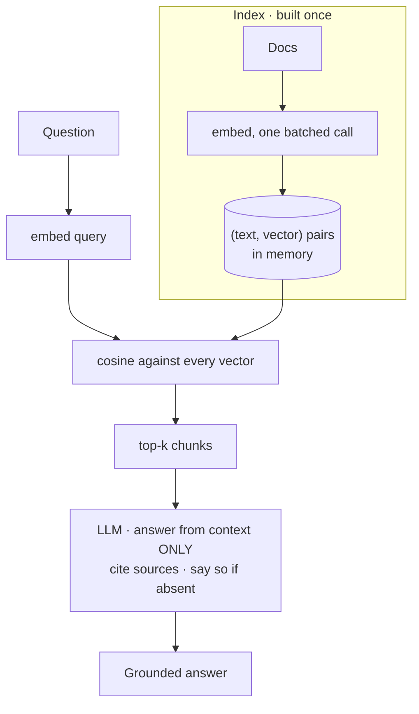

# 05 · Naive RAG

## What it is
Embed the question, find the most similar chunks of your corpus by cosine similarity, paste them
into the prompt, answer from them. Retrieval-augmented generation in its simplest honest form.

*No vector DB on purpose. Brute-force cosine over a list is exact and instant to ~10k chunks.*

## When to reach for it
**Any question of the form "answer over our data."** This is the default, and you should build it
before you build anything cleverer — it's ~40 lines and it clears the bar surprisingly often. Only
escalate to [06](../06-rag-advanced/) once you have an eval showing where it fails.

Trigger phrases: *"over our docs/wiki/tickets"*, *"a chatbot for our knowledge base"*,
*"it needs to know about our product"*, *"answer with citations"*.

## How it works
1. **Index** — embed every chunk once, in a single batched call. Keep `(text, vector)` pairs.
2. **Retrieve** — embed the query, cosine against every vector, take top-k.
3. **Generate** — stuff the k chunks in, with two non-negotiable instructions: *answer only from
   the context*, and *say so if it isn't there*. Ask for `[n]` citations so answers are auditable.

There is no vector database here on purpose. Brute-force cosine over a list is exact and instant up
to ~10k chunks. Reach for pgvector/Qdrant when you outgrow that, not before.

## Cost / latency / failure modes
2 calls (embed + generate). The failure modes are all in step 2, and all three are worth knowing:
- **Chunking** decides everything. Too small loses context, too big dilutes the embedding.
- **Vocabulary mismatch** — the user says "money back", the doc says "refund". Dense embeddings
  usually bridge this; exact IDs, error codes and product names they often don't. That's what
  hybrid search in [06](../06-rag-advanced/) fixes.
- **Top-k is a guess.** Too low misses the answer; too high buries it ("lost in the middle").

## Managed alternative worth naming
Mistral ships hosted RAG: upload files to `client.beta.libraries`, then give an agent the
`document_library` tool and it retrieves for you — no chunking, embedding, or index to run. See
[17](../17-mistral-agents-api/). Build it by hand when you need control over chunking and reranking;
use the managed one when you need it working in ten minutes.

## Composes with
[06-rag-advanced](../06-rag-advanced/) is this plus refinement; [07-agentic-rag](../07-agentic-rag/)
is this turned into a tool an agent can call repeatedly.
