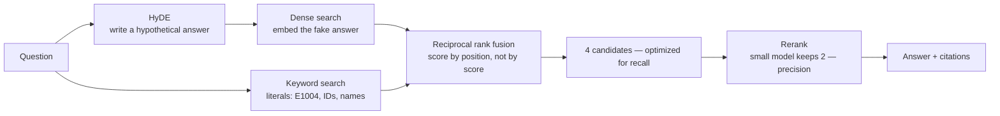

# 06 · Advanced RAG

## What it is
[Naive RAG](../05-rag-naive/) with pre-retrieval and post-retrieval refinement bolted on: rewrite the
query before searching, search two ways and fuse, then rerank before the model sees anything.

*Retrieval and reranking optimize for different things. Doing both is the whole trick.*

## When to reach for it
**Not first.** Build [05](../05-rag-naive/), find where it fails, then add exactly the refinement
that fixes that failure. Being able to say *"I'd start naive and add reranking only if eval shows
precision is the problem"* is worth more in an interview than shipping all three unprompted.

The specific symptoms each fix addresses:
| Symptom | Fix |
|---|---|
| Retrieval misses when the user words it differently than the docs | **HyDE / query rewrite** |
| Misses on error codes, IDs, product names, exact strings | **Hybrid search** |
| Right chunk is retrieved but buried among 8 irrelevant ones | **Reranking** |

## How it works
1. **HyDE** — questions and answers don't sit near each other in embedding space. So generate a
   *hypothetical answer* and embed that instead. It lands much closer to the real passage.
2. **Hybrid search** — dense vectors for meaning, keyword matching for literals (`E1004` has no
   semantics an embedding can capture). Combine with **reciprocal rank fusion**: score by rank
   position, because the two systems' raw scores aren't comparable.
3. **Rerank** — retrieve wide for recall, then have a small model keep only what's genuinely useful.
   Retrieval and reranking optimize for different things; doing both is the whole trick.
4. Generate over the 2 surviving passages instead of 8.

## Cost / latency / failure modes
~5 calls (hyde + 2 embeds + rerank + answer), and it's serial, so latency roughly triples versus
naive. Mitigate by running dense and sparse concurrently and by using a small model for hyde and
rerank (as here). Failure modes: **HyDE can hallucinate the query off-target** on questions about
things that don't exist; **the LLM reranker is the slowest link** — a dedicated cross-encoder is
faster and better if you can host one.

## Composes with
Drop this in as the retrieval tool inside [07-agentic-rag](../07-agentic-rag/) — that's the
production shape. Wrap in [12-judge-and-guardrails](../12-judge-and-guardrails/) to measure
groundedness rather than guessing at it.
