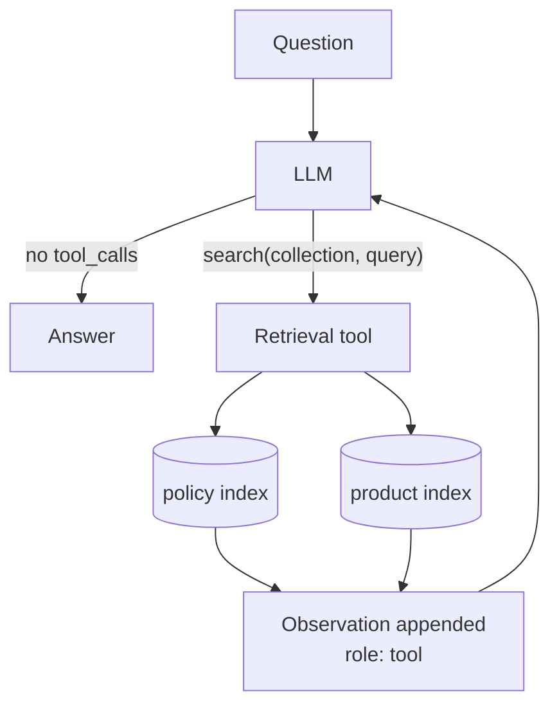

# 07 · Agentic RAG

## What it is
Retrieval stops being a fixed pre-step and becomes a **tool in an agent loop**. The model decides
whether to search, what to search for, which collection, and how many times.

*This is [05](../05-rag-naive/) + [08](../08-react-tools/). The model chooses whether, what, and how many times to search.*

## When to reach for it
When naive RAG demonstrably fails because one retrieval isn't enough:
- **Multi-part questions** — "do I get a refund *and* do I lose feature X?" needs two searches.
- **Multiple sources** — policy vs. product vs. tickets; something has to choose.
- **Iteration** — first results are thin, so try different wording.
- **Retrieval isn't always needed** — "hi, what do you do?" shouldn't hit a vector store.

Trigger phrases: *"it should figure out where to look"*, *"across our different systems"*,
*"follow-up questions"*, *"sometimes it needs to search twice"*.

## How it works
1. Wrap [05](../05-rag-naive/)'s `search()` in a tool schema. `collection` is an `enum` — constrain
   the space rather than hoping.
2. Run [08](../08-react-tools/)'s loop. The tool description does the steering: *"call once per
   sub-question, search again if results look irrelevant."*
3. Model stops calling tools → it's answering → return.

**This folder is literally 05 + 08.** Being able to say that out loud — that agentic RAG is a
composition, not a new thing — is the point of the exercise.

## Cost / latency / failure modes
3–8 calls, unpredictable, which is the tradeoff for the flexibility. Failure modes: **over-searching**
(6 searches for a one-line answer — bound `max_steps` and say "search only when needed"),
**under-searching** (answers part one, forgets part two — fix with an explicit decomposition
instruction), and **cost variance** that makes capacity planning hard.

## Composes with
Use [06-rag-advanced](../06-rag-advanced/)'s pipeline as the tool body instead of naive search —
that's the production shape. Put a [04-router](../04-router/) in front to keep non-knowledge queries
out. Scale to many collections with [10-multi-agent-supervisor](../10-multi-agent-supervisor/), one
retrieval agent per domain.
