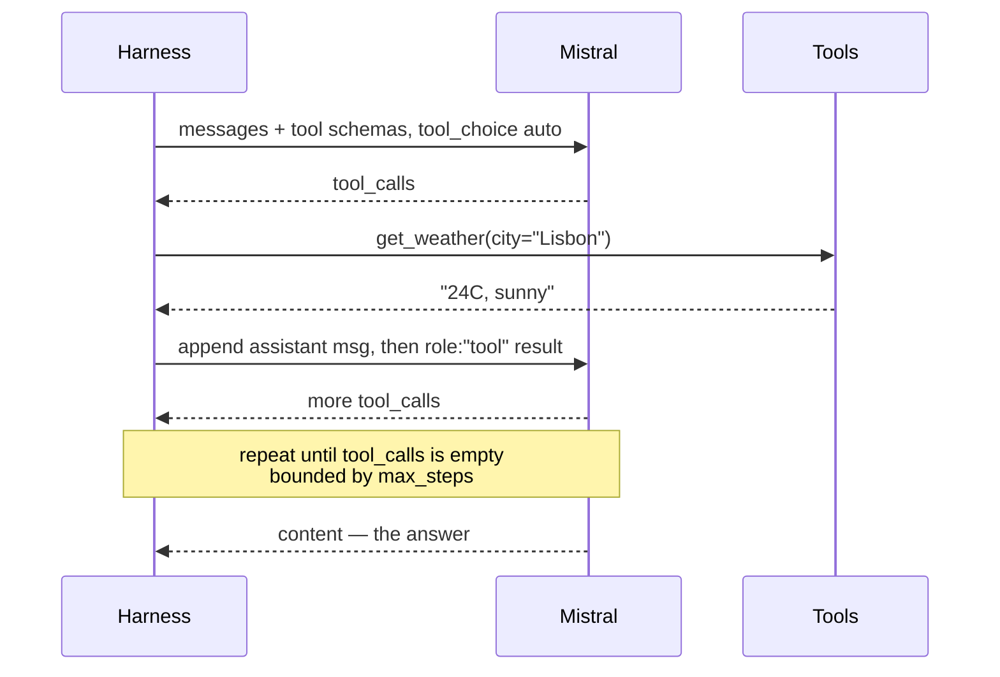

# 08 · ReAct — Tool Calling & the Agent Loop

## What it is
The model reasons about what to do, emits a structured tool call, your harness runs it and feeds the
result back, and it repeats until the model answers instead of calling a tool. **The model, not you,
decides the control flow.** This is the line where "harness" becomes "agent".

*Errors go back as tool results, not exceptions. Self-correction from an error string is most of what makes an agent feel capable.*

## When to reach for it
The task needs information or actions you can't know the sequence of in advance — *"how many steps
this takes depends on what it finds."* If you *can* know the sequence, use
[02-prompt-chaining](../02-prompt-chaining/) instead: it's cheaper and can't loop forever.

Trigger phrases: *"look it up and then"*, *"do X for me"*, *"call our API"*, *"it should figure out"*,
*anything where a step's existence depends on a previous step's result*.

**Grounded examples**
- **Coding agents** (Claude Code, Cursor's agent mode, Copilot Workspace) — read a file, run the
  tests, edit, run them again. The number of steps depends entirely on what the tests say, which is
  exactly why it can't be a fixed pipeline.
- **Ops and observability bots** — check the dashboard, query the logs, look at recent deploys,
  then answer "why is checkout slow?"
- **Travel and booking assistants** — check availability and price before recommending anything,
  because guessing either is worse than being slow.
- **Data-analysis chat** — inspect the schema, run a query, notice the result is empty, fix the
  filter, re-run. Self-correction from an error message is the whole value.

## How it works
1. Send messages + tool schemas with `tool_choice="auto"`.
2. If `msg.tool_calls` is empty, the model is answering — **that's the exit condition**.
3. Otherwise run each call, append a `{"role": "tool", "tool_call_id": ...}` message, loop.
4. Append the assistant message *before* the tool results. Order matters; the API rejects a tool
   result with no preceding call.
5. **Feed exceptions back as tool results** rather than crashing. Self-correction from an error
   string is most of what makes an agent feel capable.
6. **Always bound `max_steps`.** An unbounded agent loop is an unbounded bill.

## The part people get wrong
Tool `description` fields are the real prompt. When an agent picks the wrong tool or omits an
argument, fix the schema description before you touch the system message. Also: fewer tools is
better — accuracy degrades noticeably past ~10 tools in one context, which is what
[10-multi-agent-supervisor](../10-multi-agent-supervisor/) exists to solve.

## Cost / latency / failure modes
2 to `max_steps` calls, serial, and the full message history is resent every turn — so cost grows
quadratically with steps. Failure modes: **loops** (calling the same tool with the same args
forever — detect and break), **context bloat** on long runs (see [13-memory](../13-memory/)), and
**premature answering** where it guesses instead of calling the tool (fix in the system prompt:
"never guess X").

## Two versions here
- `main.py` — the loop by hand. ~20 lines. Know this one cold; it ports to any provider.
- `main_sdk_runner.py` — Mistral's built-in runner: `RunContext` + `conversations.run_async`.
  Derives tool schemas from your type hints and docstrings, runs the loop, returns a full trace.
  Faster to write; use it when you'd rather not own the loop.

## Composes with
Everything downstream. [07-agentic-rag](../07-agentic-rag/) is this loop with a retrieval tool;
[15-api-orchestration](../15-api-orchestration/) is this loop with real side effects;
[16-human-in-the-loop](../16-human-in-the-loop/) is this loop with an approval gate;
[10](../10-multi-agent-supervisor/) is several of these loops under a supervisor.
