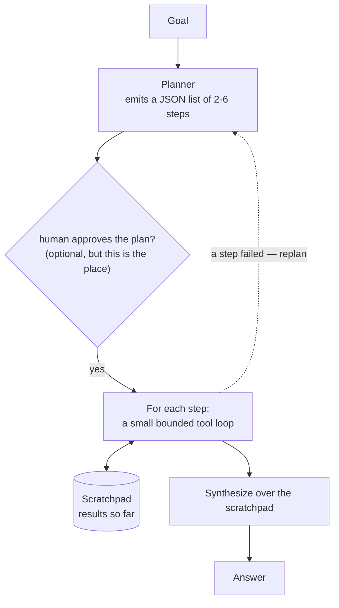

# 09 · Plan-and-Execute

## What it is
A planner call drafts the entire multi-step plan up front; an executor then carries out each step
(each a small tool loop) against a shared scratchpad. Strategy is separated from execution.

*Each step sees only itself plus the scratchpad. Small focused contexts are why this beats one long loop.*

## When to reach for it
Long-horizon tasks where [ReAct](../08-react-tools/) drifts — by step 9 a pure ReAct agent has
often forgotten what step 1 was for. Also whenever **the plan itself needs to be seen before it
runs**: a human approves it, you cost it, you log it, you edit it.

Trigger phrases: *"multi-step"*, *"research and then report"*, *"a workflow that"*, *"show me what
it's going to do first"*, *"migrate/audit/reconcile"*.

## How it works
1. **Plan** — one call, JSON out, constrained to the available tools. A list of 2–6 concrete steps.
2. *(Natural approval gate here — see [16](../16-human-in-the-loop/).)*
3. **Execute** — each step runs as its own bounded tool loop, seeing only that step plus a
   **scratchpad** of prior results. Small focused context per step is why this beats one long loop.
4. **Synthesize** — one final call over the scratchpad answers the original goal.

## The variation to name: ReWOO
Plan *all* the tool calls up front, execute them (in parallel where independent), then fuse in one
pass — the executor never re-consults the model between steps. Much cheaper and faster, but it can't
adapt when a result is surprising. Good tradeoff when the tools are reliable and the plan is
predictable.

## Cost / latency / failure modes
1 plan + (1–4 per step) + 1 synthesis. More total calls than ReAct, but each has a small context, so
often *cheaper* on tokens for long tasks. Failure modes: **a bad plan dooms everything** (there's no
recovery unless you add replanning — re-run the planner with the scratchpad when a step fails);
**over-planning** trivial tasks; **steps that aren't actually independent** stalling on a missing input.

## Composes with
[01-structured-output](../01-structured-output/) for the plan itself;
[16-human-in-the-loop](../16-human-in-the-loop/) to approve the plan before execution;
[10-multi-agent-supervisor](../10-multi-agent-supervisor/) is this pattern where each step goes to a
different specialist agent instead of the same executor.
