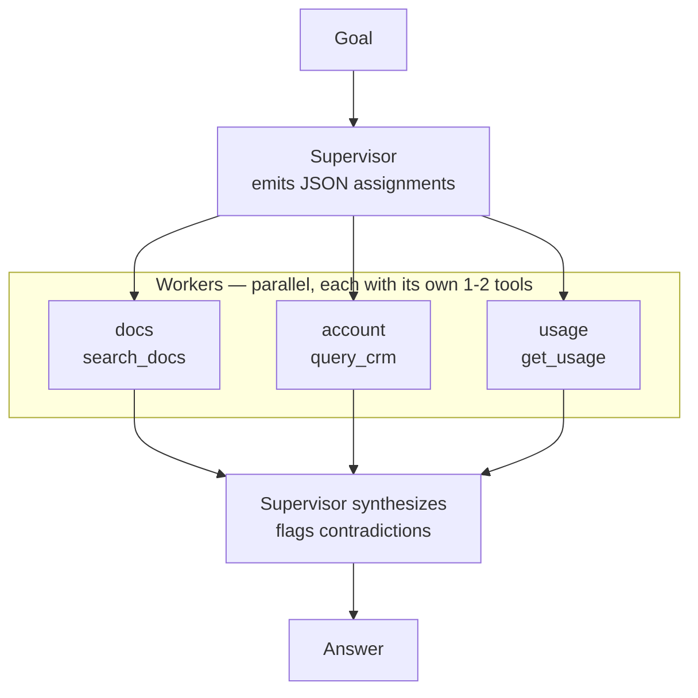

# 10 · Multi-Agent — Supervisor / Orchestrator-Worker

## What it is
A lead agent decomposes the goal, delegates sub-tasks to specialist worker agents, and synthesizes
their reports. The topology is now the *communication graph between agents*.

A worker is not a magic entity. It is **a system prompt + a subset of tools + its own message
history**. That's it. Say this out loud in the interview — it's the thing most people mystify.

*A worker is a system prompt + a tool subset + its own history. The benefit is **context isolation** — 3 tools each, not 30 in one.*

## When to reach for it
The honest answer is: **later than people think.** Reach for it when a single agent has too many
tools (accuracy degrades past ~10 in one context) or when sub-tasks genuinely benefit from different
instructions. The real win is **context isolation** — each worker sees 3 tools, not 30.

Trigger phrases: *"research across multiple sources"*, *"a team of agents"*, *"one for X, one for Y"*,
*"it needs to do several unrelated things"*.

Do **not** reach for it because multi-agent sounds impressive. One good agent beats three
coordinating badly, and coordination overhead is real.

## How it works
1. **Delegate** — supervisor emits JSON assignments, only for specialists that can actually help.
2. **Execute in parallel** — `ThreadPoolExecutor`, because these sub-tasks are independent. If they
   *weren't*, you'd want [09-plan-and-execute](../09-plan-and-execute/) instead.
3. **Synthesize** — one call over the worker reports, explicitly asked to flag contradictions.

## Cost / latency / failure modes
1 + (N workers × 2–4) + 1 calls. Expensive: this is the most token-hungry topology here. Wall-clock
stays reasonable because workers run concurrently. Failure modes: **the supervisor over-delegates**
(assigns work to specialists who can't help — hence the filter), **workers contradict each other**
and the synthesis paves over it, and **debuggability collapses** — you now have N traces, so log
every worker's input and output or you will be lost.

## Three versions here
| File | Shape | Use when |
|---|---|---|
| `main.py` | Raw SDK, **parallel fan-out** | Default. Independent sub-tasks, and you want to see everything |
| `main_handoffs.py` | Mistral Agents API, **sequential delegation** | The next specialist depends on the last one's findings; you want first-party tracing and hosted tools |
| `main_langgraph.py` | LangGraph, workers-as-tools | You need checkpointing, resumability, or approval gates |

`main_handoffs.py` is the highest-signal one for a Mistral round: `agents.update(handoffs=[...])`
declares the topology in a single line, and `handoff_execution="client"` hands control back to you
at each hop so you can log, approve, or override.

## Other multi-agent shapes worth naming (don't build them unprompted)
**Sequential handoff** (a triage line), **group chat / debate** (agents argue, surfacing errors one
instance would miss), **blackboard** (agents read/write shared state rather than messaging),
**hierarchical teams** (supervisors of supervisors), **A2A protocols** (agents discovering each other
across vendors).

## Composes with
Each worker is an [08-react-tools](../08-react-tools/) loop, often doing
[07-agentic-rag](../07-agentic-rag/). Front it with [04-router](../04-router/) so simple queries
never pay for the whole team.
