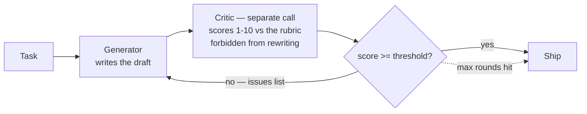

# 11 · Self-Refine / Generator-Critic

## What it is
Generate a draft, have a **separate** critic call score it against an explicit rubric and list
concrete fixes, then regenerate with that feedback. Loop until it passes or you run out of rounds.

*Exit on quality, not on a fixed count. Two prompts beat one because a critic with a clean context won't defend the draft.*

## When to reach for it
Quality matters more than latency, and quality is **judgeable** — writing, code, extraction accuracy,
anything with a rubric or a test suite. The strongest version of this substitutes a real verifier for
the LLM critic: run the tests, run the linter, validate against the schema. A deterministic critic
beats a model critic every time it's available.

Trigger phrases: *"make it good"*, *"production quality"*, *"it needs to pass review"*,
*"iterate until"*, *"generate code that actually runs"*.

## How it works
1. **Generate** a first draft.
2. **Critique** — separate call, harsh persona, explicit rubric, forbidden from rewriting. Output is
   structured (`{"score": int, "issues": [...]}`) because we branch on the score.
3. **Regenerate** with the draft + the issues, told to fix every point.
4. **Exit on the score threshold, not a fixed count** — otherwise you pay to polish something that
   was already fine.

## Why two prompts beat one
Self-critique in a single call is weak: the model has already committed to its answer and tends to
defend it. Splitting the roles gives the critic a clean context and an adversarial instruction, and
lets you use a *different* (often cheaper) model as the critic.

## The rubric is the design
A vague rubric produces vague criticism, which produces a rewrite that changes nothing. Every line
in `RUBRIC` here is checkable. If you can't write a checkable rubric, this topology won't help you.

## Cost / latency / failure modes
2 calls per round, fully serial — this is the highest-latency pattern here. Failure modes:
**score inflation** (the critic drifts up over rounds; anchor it with examples of a 4 and a 9),
**oscillation** (round 3 undoes round 2 — cap rounds, keep the best-scoring draft rather than the
last), and **diminishing returns** past round 2–3.

## Related patterns worth naming
**Self-consistency** — sample N answers at high temperature, take the majority. Great for math and
multiple-choice, costs N× calls. **Best-of-N** — generate N, keep the one a verifier rates highest;
simpler than refinement and often as good. **Multi-agent debate** — two instances argue across rounds.

## Composes with
[12-judge-and-guardrails](../12-judge-and-guardrails/) is the same critic machinery used for
*measurement* rather than improvement. Wrap any single step of
[02-prompt-chaining](../02-prompt-chaining/) in this loop.
