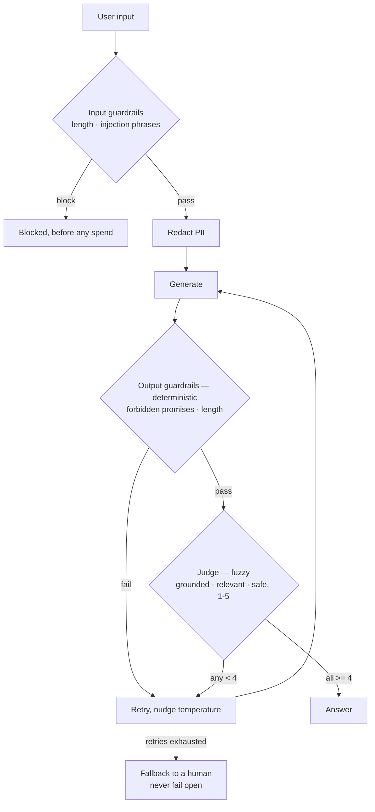

# 12 · LLM-as-Judge & Guardrails

## What it is
The reliability envelope that wraps any other topology. Two mechanisms with different jobs:

| | Guardrails | Judge |
|---|---|---|
| Implementation | Deterministic Python | An LLM call with a rubric |
| Behaviour | **Blocking** — pass or fail | **Scoring** — a number you act on |
| Cost | Free | A call per check |
| Use for | Injection, PII, length, forbidden promises, schema | Groundedness, relevance, tone, eval, reranking |

**Rule of thumb: if you can express the check in Python, do not ask a model.** Most "AI safety layer"
work is regex and length limits.

*Solid diamonds are code and they block. The dashed path is what saves you when everything else fails.*

## When to reach for it
Anything customer-facing, and anything with side effects. It's also the answer to "how do you know
it works?" — a judge run offline over a fixed set of cases is what turns that from a feeling into a
number you can track across changes.

Trigger phrases: *"how do you evaluate"*, *"how do you stop it hallucinating"*, *"it can't promise
things"*, *"PII"*, *"prompt injection"*, *"what's your eval"*.

**Grounded examples**
- **Regulated support bots** (banking, insurance, healthcare) — the bot must never promise a refund,
  quote a rate, or give medical advice. That's a deterministic output check, not a prompt hope.
- **Prompt-injection defence on anything with retrieval or tools** — retrieved documents and tool
  results are attacker-controlled text. The input guardrails in `main.py` are the minimum viable
  version.
- **Regression testing prompt changes** — an offline judge over a fixed case set is how you find out
  that "improving" the system prompt broke 12% of previously-correct answers.
- **PII redaction before egress** — strip emails, card numbers and account IDs before the text
  leaves your process, which is often a contractual requirement rather than a nice-to-have.

## How it works
1. **Input guardrails** — length, injection phrases. Blocking, before any spend.
2. **Redact** PII before it leaves your process.
3. **Generate.**
4. **Output guardrails** — forbidden commitments, length. Deterministic and blocking.
5. **Judge** — score grounded / relevant / safe on 1–5 with a small model. Retry below threshold,
   nudging temperature to escape a bad basin.
6. **Fallback to a human.** Never fail open on a customer-facing path.

## Judge caveats you should name
- **Position bias** — in pairwise comparison the first option wins too often. Randomize order.
- **Verbosity bias** — judges reward long answers. Constrain length in the rubric.
- **Self-preference** — a model rates its own output higher. Use a different model as judge.
- Judges correlate with human ratings well enough for *relative* comparison, poorly for absolute
  scores. Use them to compare v1 against v2, not to certify quality.

## Cost / latency / failure modes
+1 call per attempt, on a small model. Guardrails are free. The real failure mode is
**guardrails you never tested** — write the adversarial cases first; the injection example in
`main.py` is there to be run.

## First-party support worth naming
Mistral's Agents API takes a `guardrails=[...]` config on `agents.create`, and
`client.classifiers.moderate()` gives you a purpose-built moderation endpoint — cheaper and better
than prompting a chat model to police content.

## Composes with
Wraps everything. Pairs with [11-self-refine-critic](../11-self-refine-critic/) (same machinery,
aimed at improvement instead of measurement) and [16-human-in-the-loop](../16-human-in-the-loop/)
(what happens when the envelope rejects something).
