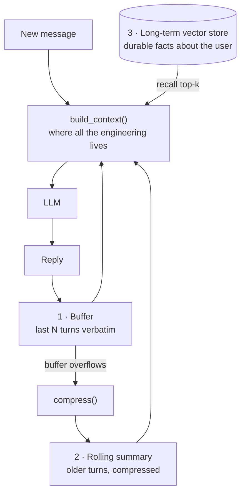

# 13 · Memory Architectures

## What it is
State that survives across turns or sessions. Orthogonal to every other topology — you bolt memory
onto a chain, an agent, or a multi-agent system without changing its shape.

Three layers, and the interview point is knowing they're **different tools, not alternatives**:

| Layer | What it holds | Fidelity | Ceiling |
|---|---|---|---|
| **Buffer** | Recent turns, verbatim | Perfect | Hard — the context window |
| **Summary** | Old turns, rolled up | Lossy | Soft — grows slowly |
| **Long-term** | Durable facts, in a vector store | Selective | None |

*Memory isn't a store, it's a **context assembly policy**. Layer 3 is [05-rag-naive](../05-rag-naive/) pointed at the agent's own history.*

## When to reach for it
The moment a second turn exists. Buffer alone is fine for short chats. Add summary when sessions run
long. Add long-term when facts need to survive *across* sessions — "remember I'm on Pro", "you told
me last week".

Trigger phrases: *"remembers the user"*, *"across sessions"*, *"personalized"*, *"long conversation"*,
*"it forgets what I said"*.

## How it works
1. Append every exchange to the **buffer**.
2. When the buffer exceeds `BUFFER_TURNS`, **compress** the overflow into a running summary — folding
   the old summary in, so it's a summary of summaries. Instruction matters: keep names, numbers,
   decisions, preferences; drop pleasantries.
3. **Recall** from long-term by embedding the incoming message and retrieving top-k facts.
   *This is literally [05-rag-naive](../05-rag-naive/) pointed at the agent's own history* — same code,
   different data. Say that out loud.
4. **Assemble**: system prompt + summary + recalled facts + verbatim buffer + new message.

Note that `build_context()` is where all the engineering lives. Memory isn't a store; it's a
**context assembly policy**.

## Cost / latency / failure modes
+1 embed per turn, +1 summarization per overflow. Failure modes: **compression loses the one detail
that mattered** (mitigate by writing important facts to long-term *before* they can be summarized
away), **recall misses** because the query and the fact are worded differently (same fix as RAG:
hybrid search), and **stale facts** — "user is on Pro" after they upgraded. Long-term memory needs
updates and deletes, not just appends. Most implementations forget this.

## Two versions here
- `main.py` — all three layers by hand. This is what you want when the state is yours to own.
- `main_server_side.py` — `conversations.start()` / `.append()` and Mistral holds the history. No
  buffer code, no resend cost, survives restarts; but the state isn't yours to inspect or migrate.

**Use server-side for conversation continuity, your own store for user facts.** You almost always
want both.

## Also worth naming
**Scratchpad / working memory** — a structured store the agent reads and writes *within* a task
(a plan file, a state object). [09-plan-and-execute](../09-plan-and-execute/)'s scratchpad is exactly
this, and it's what makes long-horizon tasks possible beyond one window.

## Composes with
[05-rag-naive](../05-rag-naive/) (identical retrieval machinery), any agent in
[08](../08-react-tools/)–[10](../10-multi-agent-supervisor/), and
[16-human-in-the-loop](../16-human-in-the-loop/) — resuming after an approval needs the state to
still be there.
