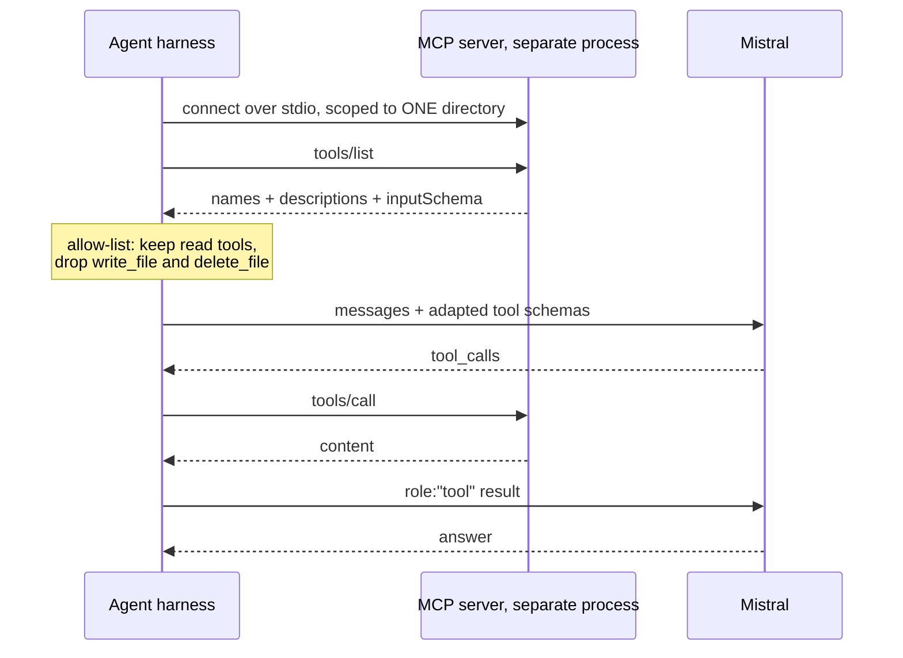

# 14 · MCP — Model Context Protocol

## What it is
An open standard for exposing tools, resources and prompts to any model. A server advertises what it
can do; the agent's client discovers and calls it at runtime. **Write the integration once, and every
MCP-aware agent can use it** — instead of writing bespoke tool glue per agent framework.

*`inputSchema` **is** a JSON schema, so the adapter is a field rename. After that it's the ordinary [08](../08-react-tools/) loop — MCP changes where tools come from, nothing else.*

## When to reach for it
- The capability you need **already has an MCP server** (GitHub, Slack, Postgres, filesystem,
  Google Drive, Sentry, Linear…). Don't rewrite it as a function.
- You want the integration reusable across agents, or maintained by someone else.
- The requirement mentions *"MCP"*, *"connect it to our tools"*, *"plug into our systems"*.

**When not to:** a single function you own. Wrapping `get_weather()` in an MCP server buys you
a subprocess and a handshake for nothing. MCP is an *integration boundary*, not a tool abstraction.

## How it works
1. **Transport** — the server runs as a separate process (stdio) or over HTTP/SSE.
2. **Discover** — `tools/list` returns each tool's name, description, and `inputSchema`.
3. **Adapt** — `inputSchema` *is* a JSON schema, so converting an MCP tool to a Mistral tool schema
   is a field rename. That's the whole adapter (`mcp_tool_to_mistral` in `main_manual.py`).
4. **Loop** — after that it's the ordinary [08](../08-react-tools/) loop. MCP changes nothing about
   the agent; it only changes where the tools came from.
5. **Route calls** — `tools/call` back over the transport, feed the result in as a tool message.

## The security point
Two boundaries matter, and both are in the code here:
- **Scope the server.** The filesystem server is launched with one directory argument. The agent
  cannot see outside it.
- **Allow-list the tools.** `tool_configuration={"include": [...]}` keeps `write_file` and
  `delete_file` off the table. A discovered tool list is not an approved tool list.

Also: MCP servers are third-party code that returns text into your model's context. A malicious or
compromised server is a prompt-injection vector. Treat tool output as untrusted input.

## Cost / latency / failure modes
Discovery is one round trip at startup. Per-call overhead is small but real (IPC + JSON). Failure
modes: **too many tools** — a big server can expose 30 tools and blow up your context and accuracy,
which is exactly what the include-list is for; **server crashes mid-run**; **schema drift** when the
server updates under you.

## Two versions here
- `main.py` — the SDK's built-in MCP client: `RunContext.register_mcp_client()`. Three lines.
- `main_manual.py` — the same thing with `mcp.ClientSession` directly, so you can see that a client
  is `list_tools` + a field rename + `call_tool`. Know this one; it's how you debug the other.

Both need `pip install mcp`, and the demo server needs Node on PATH (`npx`).

## Related integration patterns
**OpenAPI / tool specs** — point the agent at an existing REST API's schema instead of writing
functions; see [15-api-orchestration](../15-api-orchestration/). **A2A protocols** — the same
discovery idea applied to whole agents delegating to each other across vendors.
Mistral also ships **hosted connectors** (`client.beta.connectors`) with managed OAuth, so the
credential handling isn't yours — see [17](../17-mistral-agents-api/).

## Composes with
[08-react-tools](../08-react-tools/) (the loop is unchanged),
[16-human-in-the-loop](../16-human-in-the-loop/) (gate the write tools rather than excluding them),
[17-mistral-agents-api](../17-mistral-agents-api/) (attach MCP servers to a hosted agent).
