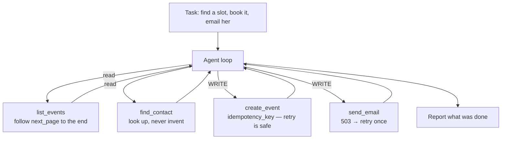

# 15 · API Orchestration (the effector layer)

## What it is
The agent chains real API calls to complete a task: read from one service, transform, write to
another. [08](../08-react-tools/) gave the model hands; this is what the hands are actually gripping.

*The LLM part is small. The engineering is idempotency, pagination, retries, and knowing which calls are reversible.*

## When to reach for it
Whenever the ask contains a verb with a consequence: *"book it"*, *"send it"*, *"update the ticket"*,
*"sync X to Y"*, *"file the expense"*. This is the topology that makes an agent worth paying for, and
it's the one where the engineering stops being about prompts.

**Grounded examples**
- **Scheduling assistants** — read the calendar, find a slot, create the event, email the invite.
  Exactly the demo in `main.py`, and the reason idempotency matters: a retried booking is a
  double-booking.
- **Expense automation** — receipt in, expense created in the finance system, approver notified.
  Two writes to two systems, which is where partial completion becomes a real problem.
- **CRM hygiene agents** — enrich a lead from an external data API, dedupe, update Salesforce.
  Pagination is not optional when the account has 4,000 contacts.
- **On-call automation** — read the alert, check the runbook, restart the service, post to the
  incident channel. Every one of those verbs is a write.

## How it works
1. **Read before you write** — list the calendar before proposing a slot.
2. **Paginate fully** — the `list_events` tool returns `next_page`, and the tool description tells
   the model to follow it. A real list endpoint always paginates; agents routinely conclude "the day
   is free" from page 1.
3. **Look up, never invent** — emails come from `find_contact`. Hallucinated identifiers are the
   most common way an action agent does real damage.
4. **Idempotency on every write** — the harness generates a key and the tool refuses a duplicate.
   Agents retry. Without this, retrying means double-booking.
5. **Retry on retryable** — `send_email` fails the first time on purpose. The error goes back to the
   model as a tool result and it recovers.
6. **Log reads and writes differently.** The `WRITE`/`read` prefix in the trace is not decoration;
   it's the audit log you'll want the first time something goes wrong.

## The design point
> "The LLM part of an action agent is small. The engineering is idempotency, retries, pagination,
> auth, and knowing which calls are reversible."

Swap the fake service bodies for `httpx` calls and the agent code above them is unchanged — that
separation is the point of the folder.

## Cost / latency / failure modes
5–12 calls, dominated by API latency rather than tokens. Failure modes, in order of how much they
hurt: **duplicate writes** (fixed above), **partial completion** — the event is created but the email
fails, leaving inconsistent state, so decide up front whether you can compensate or must roll back;
**hallucinated arguments** (constrain with enums and lookups); **auth expiry** mid-run; **rate limits**
on the third-party side.

## How to expose the APIs
- **Hand-written function tools** (here) — most control, most code.
- **OpenAPI spec** — point the agent at an existing REST schema and let it map intent to endpoints.
  Good when the API is large and well documented.
- **MCP server** — see [14](../14-mcp-client/). Best when a server already exists.
- **Mistral hosted connectors** (`client.beta.connectors`) — managed OAuth, so credentials never
  touch your code. See [17](../17-mistral-agents-api/).

## Related effector patterns worth naming
**Event-driven / webhook triggers** — an email or alert wakes the agent instead of a human prompt,
turning it into a reactive service. **Scheduled / cron agents** — it fires on a clock (a daily
digest, a monitor). **Sandboxed execution** — a container where it can run code and shell safely;
Mistral's `code_interpreter` tool is a hosted version. **Voice / telephony** — STT in, tool calls,
TTS out, in a low-latency loop. **Computer / GUI use** — clicks and screenshots when there's no API.

## Composes with
**[16-human-in-the-loop](../16-human-in-the-loop/) — do not ship this folder without it.** Every
`WRITE` in the trace above ran unapproved. Also
[12-judge-and-guardrails](../12-judge-and-guardrails/) for pre-write validation.
