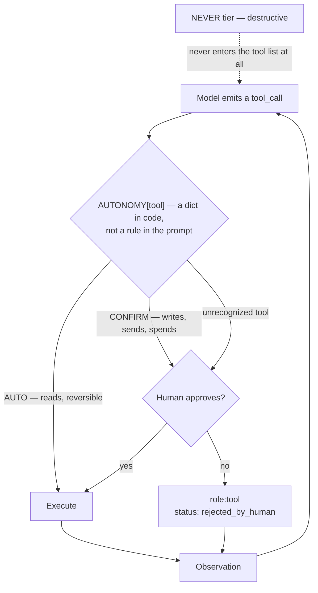

# 16 · Human-in-the-Loop & Autonomy Modes

## What it is
Defined checkpoints where the system pauses for human approval before acting. The control mechanism
on the **autonomy axis** — and usually the difference between a demo and something an org will
actually switch on.

*A rejection is an **observation**, not a crash — it goes back as a tool result the model can reason about. The `NEVER` tier is enforced by absence: those tools are never offered.*

## The rule that matters
> **Gate on side effects, not on intelligence.**

A tool's blast radius decides whether it needs approval — not the model's confidence, not the task's
difficulty. Reads run freely. Writes stop and ask. Three tiers, and they live in code:

| Tier | Covers | Example |
|---|---|---|
| `AUTO` | Read-only or trivially reversible | fetch ticket, check policy |
| `CONFIRM` | Writes, sends, spends, deletes | issue refund, email customer |
| `NEVER` | Destructive, no business case | drop table — **not in the tool list at all** |

## When to reach for it
Any time the agent can spend money, message a customer, or delete something. Also the answer to
*"how would you actually deploy this?"* — bring up the approval tier for write tools before you're
asked, and pair it with the autonomy modes below.

## How it works
1. Classify every tool in an **allow-list dict in code**. Not in the prompt — a prompt can be
   talked out of its rules; a dict lookup cannot.
2. **Fail closed**: an unrecognized tool gets `CONFIRM`, not `AUTO`.
3. On a gated call, pause and ask.
4. **A rejection is an observation, not a crash.** Feed `{"status": "rejected_by_human", "reason": ...}`
   back as the tool result so the model can explain itself or try a different route — and tell it in
   the system prompt not to retry a declined action.
5. **Resume.** In `main.py` the `messages` list is the checkpoint; in `main_tool_confirmation.py` the
   exception's `to_dict()` is a serializable one. In production the pause is a Slack message and the
   resume happens in a different process an hour later.

## The autonomy ladder (name these in the presentation)
| Mode | Who acts | Use when |
|---|---|---|
| **Copilot / suggest-and-approve** | Human executes every action | High stakes, low volume, no track record yet |
| **Supervised autonomy** | Agent acts inside a fence; sensitive actions ask | The default for real deployments — this folder |
| **Full autonomy / closed-loop** | No human in the loop | Well-bounded, well-tested, reversible |
| **Async / background** | Runs for minutes–hours, detached, checkpointed | Long-horizon work a chat turn can't hold |
| **Scheduled / cron** | Fires on a clock, not a prompt | Digests, monitors, recurring syncs |

Escalate down this list on evidence, one tool at a time. "Grant autonomy where actions are
reversible or well-tested" is the whole policy.

## Cost / latency / failure modes
No extra model calls — the cost is **human latency**, which dominates everything else. Failure modes:
**approval fatigue** (gate too much and people rubber-stamp, which is worse than no gate because it
looks like control), **the pause that can't resume** (state wasn't serializable — the actual reason
this is hard), and **an incomplete allow-list** where a new tool ships ungated. Test that path.

## Two versions here
- `main.py` — the gate by hand. The `AUTONOMY` dict is your security policy, visible in one screen.
- `main_tool_confirmation.py` — Mistral's built-in version: `register_func(fn, requires_confirmation=True)`
  raises `DeferredToolCallsException` instead of executing. The pending call is a first-class,
  serializable object with `.confirm()` / `.reject()`, which is what a real approval queue needs.
  Server-side agents get the same thing via `conversations.append(tool_confirmations=[...])`.

LangGraph's equivalent is `interrupt()` plus a checkpointer — that's the main reason to reach for it.

## Composes with
**[15-api-orchestration](../15-api-orchestration/) — these two belong together.** Every write in 15
runs unapproved; this folder is the missing half. Also
[12-judge-and-guardrails](../12-judge-and-guardrails/) (deterministic checks first — don't waste a
human on something a regex can reject) and [09-plan-and-execute](../09-plan-and-execute/) (approve
the whole plan once, rather than every step).
