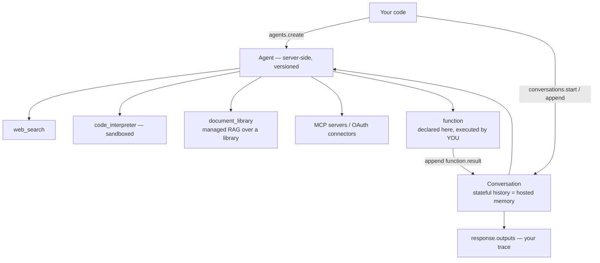

# 17 · The Mistral Agents API (first-party)

**Read this folder first if the interview is at Mistral.** Everything the other folders build by
hand, their platform hosts — and using it shows you know their product, not just the general pattern.

## What it is
A stateful, server-side agent runtime. You create `Agent` objects with tools attached, then drive
them through `conversations`. Mistral runs the loop, holds the history, and hosts the tools.

*Everything except `function` runs on their side. You trade visibility for speed — usually the right trade in a 40-minute build.*

## The mapping — what it replaces
| Built by hand in | Hosted equivalent |
|---|---|
| [05](../05-rag-naive/) / [06](../06-rag-advanced/) RAG | `document_library` tool over an uploaded library (`hosted_rag.py`) |
| [08](../08-react-tools/) agent loop | `conversations.start` — the loop runs server-side |
| [13](../13-memory/) memory | `conversations.append` — no resend, survives restarts |
| [12](../12-judge-and-guardrails/) guardrails | `guardrails=[...]` on `agents.create` |
| [14](../14-mcp-client/) MCP | MCP servers and hosted connectors with managed OAuth |
| [15](../15-api-orchestration/) sandboxed execution | `code_interpreter` tool |
| [16](../16-human-in-the-loop/) approval | `conversations.append(tool_confirmations=[...])` |
| [10](../10-multi-agent-supervisor/) multi-agent | `agents.update(handoffs=[...])` |

## When to reach for it
- The clock is running and the ask is *"an assistant that knows our docs and remembers me."*
- You want web search, code execution, or image generation without building any of it.
- You're interviewing at Mistral. Reaching for their platform is the point.

## When to build it by hand instead
- **Quality is what's being evaluated.** You can't see retrieval scores, can't change chunking,
  can't rerank. If the eval is "make RAG accurate", own the pipeline ([06](../06-rag-advanced/)).
- **You need the state.** Server-side history isn't yours to inspect, migrate, or diff.
- **Portability matters.** This is the one folder that doesn't transfer to another provider.

Saying *"I'd use the hosted document_library to get to an answer today, and swap in my own hybrid +
rerank pipeline once we have an eval showing retrieval is the bottleneck"* is the strongest version
of this answer.

## Tool types available on `agents.create`
`web_search` · `web_search_premium` · `code_interpreter` · `image_generation` ·
`document_library` (managed RAG) · `function` (you execute it, same contract as [08](../08-react-tools/)) ·
custom connectors (MCP / hosted OAuth integrations).

## Files here
- `main.py` — an agent with `web_search` + `code_interpreter`, a stateful two-turn conversation,
  a locally-executed `function` tool, and the server-side audit trail.
- `hosted_rag.py` — `libraries.create` → upload → `document_library` agent. Managed RAG end to end.
- See also [10/main_handoffs.py](../10-multi-agent-supervisor/main_handoffs.py) for multi-agent, and
  [13/main_server_side.py](../13-memory/main_server_side.py) for memory in isolation.

## Things that will bite you
- **Ingestion is async.** Poll `libraries.documents.status(...)` before querying, or the first
  answers come back empty.
- **`agents.create` is a write.** Don't call it per request; create once, store the id. The API is
  versioned (`agents.update` makes a new version) which is genuinely useful for prompt rollback.
- **`store=True`** is what makes a conversation persistent. Check it if follow-ups lose context.
- **Read `response.outputs` by `entry.type`** (`message.output`, `function.call`, `tool.execution`,
  `agent.handoff`) — that list *is* your trace, and it's the first place to look when an agent
  misbehaves.

## Also on the platform, worth naming
`client.beta.connectors` (hosted integrations with managed OAuth — credentials never touch your
code) · `client.beta.skills` and `beta.prompts` (versioned, reusable prompt/skill assets) ·
`client.workflows` (durable, checkpointed orchestration — the managed answer to what LangGraph's
checkpointer does) · `client.classifiers.moderate` (purpose-built moderation) ·
`client.chat.parse` (typed structured output — see [01](../01-structured-output/)).
