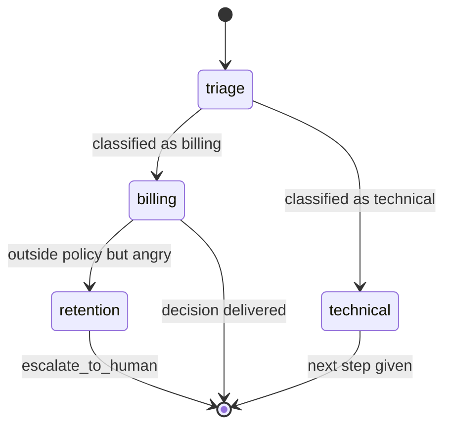

# 18 · Sequential Handoff (agent pipeline)

## What it is
Agents arranged in a line (or small directed graph), each owning one stage. Each agent either
finishes the case or **hands control forward** to a named successor. Unlike a chain, the node
decides where control goes; unlike a supervisor, nobody fans out and collects.

*Control moves forward and doesn't come back. Each stage's `next` list is an **enum** in the handoff tool — that's what keeps the graph bounded.*

## When to reach for it
This is the shape of essentially every real support, triage, and intake system, and it's the most
likely right answer to *"build a customer service agent"*.

Trigger phrases: *"triage"*, *"escalate"*, *"first-line then specialist"*, *"route to the right team"*,
*"intake process"*, *"tier 1 / tier 2"*.

**Handoff vs. supervisor** — the distinction that decides which one you want:
| | [10 Supervisor](../10-multi-agent-supervisor/) | 18 Handoff |
|---|---|---|
| Control | Fans out, then returns to the lead | Moves forward, doesn't come back |
| Sub-tasks | Independent → run in parallel | Dependent → stage N+1 needs stage N |
| Who answers | The supervisor synthesizes | Whichever agent is holding the case |
| Failure shape | Contradictory workers | Infinite ping-pong between stages |

**Grounded examples**
- **Telecom and airline support** — triage → billing → retention, where the retention stage exists
  precisely because the billing stage said no and the customer is now angry. That escalation path is
  the business process, not an implementation detail.
- **Healthcare intake** — symptom triage → nurse line → scheduling, with a hard stop at anything
  clinical. Each stage has different tools and, critically, different authority.
- **Order support** — order status → returns → refunds → human, each stage owning its own systems.
- **Recruiting screens** — application intake → skills screen → scheduling, passing accumulated
  notes forward at each hop.

## How it works
1. Each stage is a system prompt + its own tools + **an allow-list of legal successors** (`next`).
2. The handoff decision is a tool call whose `to` parameter is an **enum of only the legal next
   stages**. That enum is what keeps the graph bounded — without it the model invents destinations.
3. Notes accumulate and travel with the case, so each stage sees what earlier stages found without
   inheriting their full context.
4. **Bound the hops.** A graph with cycles (billing → retention → billing) will loop.

## Cost / latency / failure modes
2–5 calls per stage, strictly serial, so latency is the sum — the slowest multi-agent shape.
Failure modes: **ping-pong** between two stages that each think it's the other's problem (cap hops
and make the successor list narrow), **hot-potato triage** where the first agent hands off everything
without gathering anything (fix in the stage prompt: state explicitly what it must collect first),
and **context loss at the boundary** — a detail the customer gave at triage never reaches retention.
The notes list is the fix; make sure it carries facts, not summaries of summaries.

## First-party version
Mistral does this natively: `agents.update(agent_id=..., handoffs=[other_agent_ids])`, then one
`conversations.start()`. Mistral routes between them and every hop appears as an `agent.handoff`
entry in the trace. `handoff_execution="client"` returns control to you at each hop so you can log,
approve, or override — see
[10/main_handoffs.py](../10-multi-agent-supervisor/main_handoffs.py).

## Composes with
[04-router](../04-router/) is the degenerate one-hop case — if there's no second decision point, a
router is cheaper and you should use it. [16-human-in-the-loop](../16-human-in-the-loop/) is the
natural terminal stage (`escalate_to_human`). Each stage is an
[08-react-tools](../08-react-tools/) loop.
