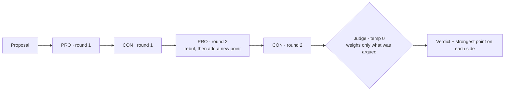
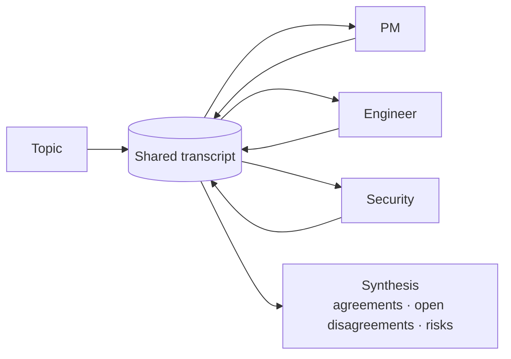

# 19 · Multi-Agent Debate & Group Chat

## What it is
Several model instances with **different mandates** talk across rounds over a shared transcript,
then something adjudicates. Two flavours, both in `main.py`:

- **Adversarial debate** — fixed PRO/CON roles instructed not to concede, then an impartial judge.
- **Round table / group chat** — distinct personas (PM, Engineer, Security) speaking in turn,
  then a synthesis.

**Adversarial debate** — opposed mandates, then an adjudicator:

**Round table** — shared transcript, personas speak in turn:

*Both need the constraint that stops convergence: never concede (debate) / never repeat others (round table).*

## Why it works
A single model asked *"is this a good idea?"* anchors on its first framing and then rationalizes.
Give two instances **opposed mandates** and they surface objections neither would raise alone. It's
an ensemble over *reasoning* rather than over sampling — which is why it beats
[self-consistency](../11-self-refine-critic/) on questions that don't have one right answer.

## When to reach for it
- **Genuinely contested decisions** — architecture choices, risk calls, go/no-go.
- **Finding blind spots** — the round table exists to make someone say the thing nobody thought of.
- **Red-teaming** your own plan before a human reviews it.

Trigger phrases: *"pros and cons"*, *"stress-test this"*, *"what are we missing"*, *"get different
perspectives"*, *"should we"*.

**When not to:** anything with a checkable answer. If a test, a rubric, or a retrieval can settle it,
debate is an expensive way to get a worse result. Use [11](../11-self-refine-critic/) instead.

## How it works
1. Each agent gets a role prompt that **forbids conceding** (adversarial) or **forbids repeating
   others** (round table). Without those constraints both agents converge to the same bland
   paragraph by round 2 — this is the single most common way debate implementations fail.
2. `temperature=0.7`: some variance is required or the instances are identical.
3. The shared transcript grows and every agent sees all of it.
4. **A judge or synthesizer at the end, at temperature 0**, explicitly told to weigh only arguments
   actually made. A debate with no adjudicator is just noise.

## Cost / latency / failure modes
`rounds × agents + 1` calls, serial, with a transcript that grows every turn — so this is the most
expensive topology per unit of output in the repo. Failure modes: **premature convergence** (fixed by
the no-concede instruction), **confident nonsense reinforced** — two instances of the same model
share the same blind spots, so use *different models* as the debaters if you can, **judge bias**
toward the last or longest speaker (randomize order, cap length), and **cost blowup** at 3+ rounds
with no measurable gain.

## Related shapes
**Mixture-of-Agents** ([21](../21-mixture-of-agents/)) is the parallel, non-adversarial cousin:
independent drafts, aggregated, no argument. **Constitutional / self-critique** is the single-agent
version — critique your own output against written principles.

## Composes with
[12-judge-and-guardrails](../12-judge-and-guardrails/) — the judge here is the same machinery.
Feed the verdict into [16-human-in-the-loop](../16-human-in-the-loop/) when the decision has
consequences: a debate transcript is unusually good material for a human approver to read.
