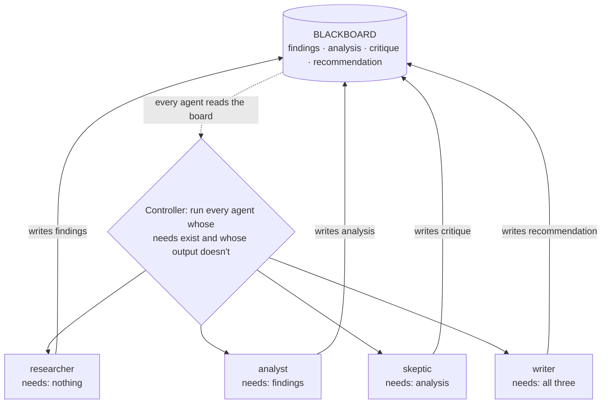

# 20 · Blackboard (shared state)

## What it is
Agents read from and write to a **shared workspace** instead of messaging each other. Contributions
accumulate on the board until the problem is solved. A small controller loop decides who runs next,
based purely on what data exists.

*The topology is the **data**, not a message graph. No agent knows another exists, so adding a fifth changes nothing — and the board is plain data, so the whole run is resumable.*

## The inversion that makes it worth knowing
In [10](../10-multi-agent-supervisor/) and [18](../18-sequential-handoff/) the topology is
**who-talks-to-whom**, so adding an agent means rewiring the graph. Here the topology is **the data**.
Each agent declares what it `needs` and what it `produces`, and that's the only coordination
mechanism — no agent knows any other exists. Adding a fifth agent changes nothing about the other four.

That decoupling is why blackboard systems stay manageable as they grow, and it's the same idea as an
agent writing to a plan file: **working memory, made shared**.

## When to reach for it
- **Long-horizon work** where the state must outlive any single agent run.
- **Many contributors** where you don't want an N² message graph.
- **Resumability** — because the board is plain data, persist it and the controller picks up exactly
  where it stopped. This is the cheapest durable-execution story there is.
- You need a real answer to *"what happens if it crashes halfway through?"*

Trigger phrases: *"agents collaborating on a document"*, *"build up an analysis"*, *"it runs for a
while"*, *"resumable"*, *"shared context between agents"*.

**Grounded examples**
- **Long-running research reports** — sections accumulate on the board over minutes or hours, and
  the run survives a restart because the board is just data.
- **RFP and proposal generation** — a compliance contributor, a pricing contributor and a technical
  contributor all write into one document, in whatever order their inputs become available.
- **Incident postmortems** — timeline, impact, root cause and action items assembled by different
  agents as the underlying data arrives.
- **Agent scratchpad files in coding tools** — a `PLAN.md` or todo list the agent reads and updates
  as it works is the single-agent form of exactly this, and it's why long tasks stay coherent.

## How it works
1. The **board** is a dict (in production: a Postgres row, a JSON file, a Redis hash). Durable and
   inspectable is the whole requirement.
2. Each agent declares `needs` (keys that must exist) and `produces` (the key it writes).
3. The **controller** picks every agent whose inputs exist and whose output doesn't. Deliberately
   boring — the intelligence belongs in the agents, not the scheduler.
4. Loop until nothing is ready. Dependencies create the ordering implicitly; there's no plan.

## Cost / latency / failure modes
One call per agent per contribution, and agents in the same cycle are trivially parallelizable (add a
`ThreadPoolExecutor` — nothing else changes, which is the point). Failure modes: **deadlock** when
nothing is ready and the goal isn't met (log the unmet `needs`; don't just exit), **board bloat** —
every agent sees the whole board, so context grows with contributions, so give agents scoped views
once it's big, and **write conflicts** if two agents produce the same key (here `produces` is unique
by construction; with concurrent writers you need versioning).

## Related shapes
**Hierarchical teams** — supervisors of supervisors, when one layer of workers isn't enough. Reach
for it only when a single supervisor's tool list has itself become too long.
**Network / peer-to-peer** — agents talk many-to-many with no controller. Maximum flexibility,
genuinely hard to bound or debug; a blackboard gets you most of the decoupling without that cost.

## Composes with
[13-memory](../13-memory/) — the board *is* scratchpad memory, shared.
[09-plan-and-execute](../09-plan-and-execute/)'s scratchpad is the single-agent version.
Wrap the final write in [16-human-in-the-loop](../16-human-in-the-loop/) when the output gets acted on.
