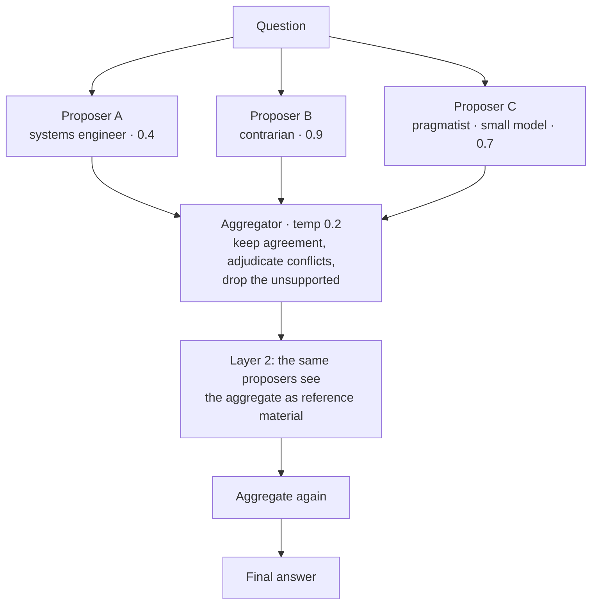

# 21 · Mixture-of-Agents (layered ensemble)

## What it is
Several **proposers** answer the same question independently and in parallel. An **aggregator** reads
all the drafts and writes a better one. Optionally repeat: the next layer's proposers see the previous
aggregate as reference material — that's what makes it *layered* rather than just voting.

*Proposers never interact — that's what separates this from [debate](../19-agent-debate/). Diversity is the active ingredient: vary the **model** where you can.*

## Why it works
Different drafts fail in different places, and the aggregator can see *where they disagree* — which
is more information than any single draft carries. The aggregate reliably beats every individual
proposer, including proposers stronger than the aggregator itself.

**Diversity is the active ingredient.** Vary the *model* where you can; vary persona and temperature
where you can't. Three identical proposers buy you nothing but three times the bill.

## When to reach for it
- Open-ended, high-value output where quality justifies 3–7× the cost: a strategy memo, an
  architecture recommendation, a customer-facing document.
- You have access to several models and want to beat all of them.
- Offline or batch work where latency doesn't matter.

Trigger phrases: *"best possible answer"*, *"we have budget for quality"*, *"combine multiple models"*,
*"ensemble"*.

**When not to:** anything latency-sensitive, anything with a single checkable answer (use
self-consistency — cheaper), anything where a verifier exists (use best-of-N — simpler).

## How it distinguishes itself from its neighbours
| Pattern | Interaction | Selection | Use when |
|---|---|---|---|
| **Self-consistency** ([11](../11-self-refine-critic/)) | None, same prompt N× | Majority vote | One right answer (maths, MCQ) |
| **Best-of-N** | None | A verifier picks one | You have a real verifier |
| **Debate** ([19](../19-agent-debate/)) | Adversarial, sequential | A judge decides | Contested decisions |
| **MoA** (here) | None — parallel, cooperative | Aggregated into new text | Open-ended prose quality |

## How it works
1. **Propose in parallel** (`ThreadPoolExecutor`) — distinct personas, distinct temperatures,
   distinct models where available.
2. **Aggregate** at low temperature, with the instruction that does the work: keep agreement, pick
   the better-reasoned side of conflicts and say why, drop the unsupported, and never mention that
   drafts existed.
3. **Layer 2** — proposers see the aggregate as *reference material*, explicitly told to improve on it
   and not merely agree. Without that clause layer 2 just paraphrases layer 1.

## Cost / latency / failure modes
`layers × proposers + layers` calls. Wall-clock is roughly `layers × (slowest proposer + aggregator)`
because proposers run concurrently. Failure modes: **homogeneity** (identical proposers → no gain;
this is the #1 implementation error), **regression to the mean** where the aggregator sands off the
one genuinely sharp insight (mitigate by asking it to preserve specific claims), **cost with no
measured gain** past 2 layers, and **an aggregator weaker than its proposers** becoming the ceiling.

## Composes with
[11-self-refine-critic](../11-self-refine-critic/) — critique the aggregate for a further lift.
[12-judge-and-guardrails](../12-judge-and-guardrails/) to actually *measure* that MoA beat a single
call, rather than assuming it. Use MoA on the synthesis step of
[10-multi-agent-supervisor](../10-multi-agent-supervisor/) when that final answer is the deliverable.
