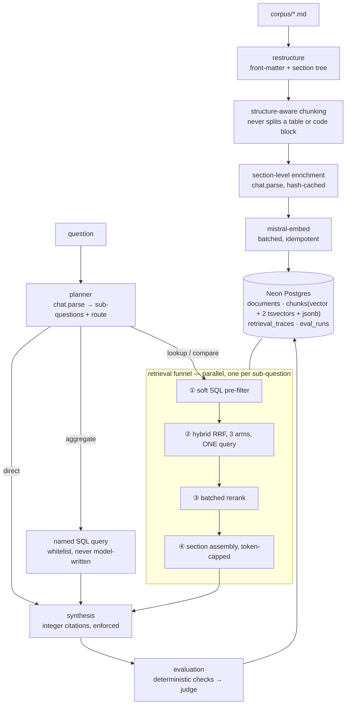

# 22 · Production RAG on Neon

> **This folder deliberately breaks the repo's rules.** Every other folder is one
> file, no dependencies, runs with just an API key. This one is fifteen modules, a
> Postgres database, and a schema. That contrast *is* the lesson: folders
> [05](../05-rag-naive/)–[07](../07-agentic-rag/) teach the mechanism; this is what
> the mechanism costs when the data is real.

## What it is
A RAG system with the parts the toy examples leave out: an ingestion pipeline that
restructures and chunks documents with awareness of their structure, a single Neon
Postgres holding **both** the relational metadata and the vectors, a four-stage
retrieval funnel, and a reasoning engine that plans, routes, fans out, and gets
graded.



*Every model call is Mistral: `mistral-embed` for vectors, `chat.parse` for typed
enrichment and planning, `chat.complete` for rerank, synthesis and judging.*

## When to reach for it
When the answer to "just use naive RAG" stops being yes — which is usually the
moment one of these is true:

- The corpus has **structure that carries meaning**: tables, procedures, code. Fixed-size
  chunking destroys it and no amount of reranking gets it back.
- You need to **filter as well as search** — by tenant, product, date, document type.
  This is what pure vector stores are worst at and Postgres is best at.
- People search for **literal identifiers** — error codes, CLI flags, function names —
  which dense embeddings structurally cannot match.
- You need to **explain a wrong answer**, which means per-stage tracing.

**Grounded examples**
- **Internal documentation assistants** over a wiki plus runbooks plus release notes,
  where "which doc type is this in?" is a real filter and freshness matters.
- **Customer support deflection** where the question is half prose ("my payments are
  failing") and half literal ("with error E1004"). Hybrid retrieval is not optional.
- **Compliance and policy Q&A**, where an answer without a citation to the controlling
  document is worthless, and refusing is better than guessing.
- **Developer portals** where the corpus is versioned and users ask about a specific
  release.

## How it works

### 1. Ingestion — `chunking.py`, `enrich.py`, `ingest.py`
Front-matter becomes relational columns. The body is parsed into blocks, and **fenced
code and tables are atomic** — an oversized whole table beats two useless halves.
Chunks never span a heading boundary and each carries its `heading_path`, which is
**prepended to the embedded text** so a row of numbers knows it is about rate limits.

Enrichment happens at the **section** level, not per chunk, cached by
`sha256(section_text)`. Per-chunk enrichment is ~36 calls here and tens of thousands
on a real corpus, re-paid every time you touch the chunker. Ingest is **idempotent by
content hash** and **commits per document**.

### 2. Storage — `schema.sql`
One database, both jobs. `chunks` carries `vector(1024)`, **two** generated tsvectors,
and a `jsonb` metadata column; `documents` carries the filterable columns.
`retrieval_traces` records which chunk ids survived each funnel stage — the single
most useful table here, because it is what turns "the answer was wrong" into "stage 3
dropped it".

### 3. Retrieval funnel — `filters.py`, `search.py`, `retrieve.py`
1. **Soft SQL pre-filter.** Filter values are a **closed enum read from the corpus at
   runtime** and handed to the planner, so it cannot invent `service='billing-service'`
   when the corpus says `billing`. And filters are soft: if too few candidates survive,
   retrieval re-runs unfiltered and flags `filter_relaxed`.
2. **Hybrid search, three arms, one SQL query.** Dense cosine, `english` full-text
   (stemmed, for prose), and `simple` full-text (unstemmed, so `E1004` and
   `pg_stat_statements` survive), fused with reciprocal rank fusion in Postgres.
3. **Rerank** — one batched call, with a fallback so a parse failure can never empty
   the context.
4. **Assembly** — expand to the surrounding section within a hard token budget,
   dropping *expansions* rather than chunks when the budget runs out.

### 4. Reasoning engine — `planner.py`, `queries.py`, `reason.py`
The planner emits typed sub-questions with a **route enum**. `aggregate` routes to a
**whitelist of named parameterized queries** — the model picks a name and fills
params, and never writes SQL. Sub-questions run **in parallel**; these are typed
retrieval workers, not personas. Synthesis cites **integers** mapped back to chunk ids
in code, because UUIDs in a prompt get typo'd.

### 5. Evaluation — `evaluate.py`
Deterministic first: citation validity, hit rate, MRR — no model call, and they
separate a *retrieval* failure from a *generation* failure. Judge second. Negatives in
the golden set check that it refuses rather than confabulates.

## Cost / latency / failure modes
Ingest is one embedding call per 32 chunks plus one enrichment call per section. A
query is 1 planner + N×(1 embed + 1 rerank + 1 answer) + 1 synthesis — **the fan-out
makes cost non-obvious**, which is why `main.py` prints the funnel counts.

The failure modes worth knowing, all of which have a defence in the code:

| Failure | Where it bites | Defence |
|---|---|---|
| Planner invents a filter value | Zero rows, confident wrong answer | Runtime enum + soft filters |
| Chunk splits a table | Header-less rows embed as noise | Atomic blocks + chunker self-test |
| Reranker drops the only good chunk | Answer looks plausible, misses the fact | `retrieval_traces`, floor on `keep` |
| Model fabricates a citation | Unverifiable answer | Integer citations + range check |
| pgvector post-filtering | Under-filled results under a selective `WHERE` | `iterative_scan`, exact scan at this size |
| `register_vector` per borrow | ~3.5s of catalog lookup **per operation** | Register once per physical connection, in the pool's `configure` |
| Aggregates over LLM metadata | Numbers that describe the enrichment pass | Provenance stated in the answer |

## A measured lesson about latency
The first version opened a connection per operation and re-registered the pgvector
type adapter each time. The 15-question eval took **6m56s** with ~0% CPU. The instinct
is to blame the network; the measurement said otherwise:

| | cost |
|---|---|
| `SELECT 1` on an open connection | 0.30 s |
| `psycopg.connect()` | 1.82 s |
| **`register_vector()`** | **3.55 s** |

`register_vector` is a catalog lookup for the type OID — several round trips — and it
belongs in the pool's `configure` callback, which runs once per *physical* connection.
Moving it there took a query from 4.2s to 1.1s and the eval from 6m56s to 2m04s.
The remaining second is the pool's
liveness check plus transaction framing, which is the price of surviving Neon's
autosuspend and worth paying.

## Running it
```bash
pip install -r requirements.txt
./setup_neon.sh                    # provisions Neon, writes .env, applies the schema
echo "MISTRAL_API_KEY=..." >> .env
python chunking.py                 # self-test, no network
python ingest.py
python main.py "what is the refund window for annual plans?"
python evaluate.py
```

**Offline mode.** With no `MISTRAL_API_KEY`, embeddings fall back to deterministic
pseudo-vectors so the schema, the SQL and the entire funnel stay runnable and
testable. Those vectors carry no meaning — lexical retrieval works properly, dense
retrieval is noise. Everything says so loudly. This exists so the *database* half can
be verified independently of the *model* half, which is a genuinely useful split.

## Composes with
[05](../05-rag-naive/) and [06](../06-rag-advanced/) are this folder's retrieval
without the database — read those first. [07](../07-agentic-rag/) is what to build
instead if questions need iterative search rather than a plan.
[10](../10-multi-agent-supervisor/) is the fan-out shape used here.
[12](../12-judge-and-guardrails/) is the deterministic-checks-before-judge discipline
that `evaluate.py` follows. [17](../17-mistral-agents-api/) is the managed
alternative: `document_library` gives you hosted RAG in ten lines, and you give up
exactly the control this folder exists to demonstrate.
