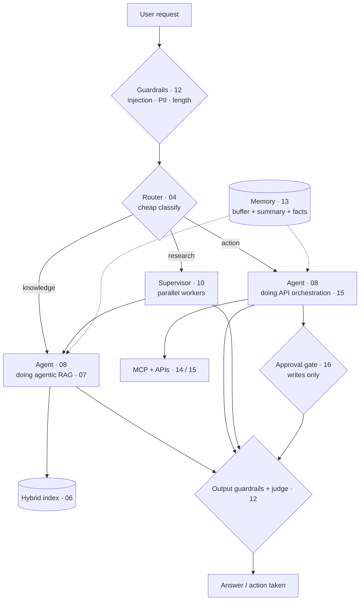

# Harness Engineering 101

**The model is fixed. The harness is where the engineering happens.**

Take a text-to-text LLM as a frozen API and everything that makes it useful lives in the scaffolding
around it: how context is assembled, how calls are sequenced, how tools and memory are wired in, and
who holds control of the loop. This repo is a catalogue of those scaffolds — each one a single short
Python file against the Mistral API that you can read in 30 seconds and adapt.

Every folder has a raw-SDK `main.py` that runs with nothing but an API key, plus a README covering
*when to reach for it*, *how it works*, and *how it fails*. Framework versions appear as a second
file only where they earn their keep.

```bash
pip install -r requirements.txt
export MISTRAL_API_KEY=...          # console.mistral.ai/api-keys
python 08-react-tools/main.py
```

---

## The catalogue

### Single calls and fixed pipelines — *you* hold control
| # | Topology | One line |
|---|---|---|
| [01](./01-structured-output/) | **Structured output** | Force the answer into a schema so ordinary code can branch on it. The adapter under everything else |
| [02](./02-prompt-chaining/) | **Prompt chaining** | Output of call N is input to call N+1. Three narrow steps beat one mega-prompt |
| [03](./03-map-reduce/) | **Map-reduce** | Chunk it, process the chunks in parallel, aggregate once. For corpora bigger than the window |
| [04](./04-router/) | **Router / cascade** | A cheap call classifies, then dispatches to a specialist prompt — and a right-sized model |

### Retrieval — giving it knowledge
| # | Topology | One line |
|---|---|---|
| [05](./05-rag-naive/) | **Naive RAG** | Embed the query, take top-k by cosine, stuff it in the prompt. Start here, always |
| [06](./06-rag-advanced/) | **Advanced RAG** | Naive plus query rewriting (HyDE), hybrid dense+keyword search, and reranking |
| [07](./07-agentic-rag/) | **Agentic RAG** | Retrieval becomes a tool the model calls — it decides whether, what, and how many times |

### Agents — the model holds control
| # | Topology | One line |
|---|---|---|
| [08](./08-react-tools/) | **ReAct / tool calling** | Reason → act → observe, in a loop. **The** pattern; everything below is a variation |
| [09](./09-plan-and-execute/) | **Plan-and-execute** | Draft the whole plan first, then execute it step by step. The plan is inspectable before anything runs |

### Multi-agent — the topology becomes the communication graph
| # | Topology | One line |
|---|---|---|
| [10](./10-multi-agent-supervisor/) | **Supervisor / orchestrator-worker** | A lead decomposes, workers run in parallel, the lead synthesizes. The default shape |
| [18](./18-sequential-handoff/) | **Sequential handoff** | Agents pass control down a line, each owning a stage. Every real triage system |
| [19](./19-agent-debate/) | **Debate & group chat** | Opposed mandates argue across rounds, a judge decides. For contested calls |
| [20](./20-blackboard/) | **Blackboard** | Agents read/write shared state instead of messaging. Decoupled, and resumable |
| [21](./21-mixture-of-agents/) | **Mixture-of-agents** | Independent drafts in parallel, aggregated into a better one. Layer to taste |

### Quality, state and control — the envelope
| # | Topology | One line |
|---|---|---|
| [11](./11-self-refine-critic/) | **Generator-critic** | Draft → critique against a rubric → revise. Exit on score, not on round count |
| [12](./12-judge-and-guardrails/) | **Judge + guardrails** | Deterministic checks that block; a scoring model that measures. Know which is which |
| [13](./13-memory/) | **Memory** | Buffer → rolling summary → vector long-term recall. Bolt onto any topology |

### Action and integration — where agents do things
| # | Topology | One line |
|---|---|---|
| [14](./14-mcp-client/) | **MCP** | Discover and call tools from any MCP server. Write the integration once, every agent gets it |
| [15](./15-api-orchestration/) | **API orchestration** | Read one service, write another — with idempotency, pagination and retries. Where "do it for me" cashes out |
| [16](./16-human-in-the-loop/) | **Human-in-the-loop** | Gate on side effects, not on intelligence. Reads run; writes ask |
| [17](./17-mistral-agents-api/) | **Mistral Agents API** | The first-party stack: hosted RAG, server-side memory, hosted tools, handoffs |

Also: **[FRAMEWORKS.md](./FRAMEWORKS.md)** — LangGraph, CrewAI, Pydantic AI and the 2026 landscape,
with a decision rule for when each one earns its place.

---

## Requirement → topology

Read the requirement, find the row, start there.

| What you're asked for | Start with | Escalate to |
|---|---|---|
| "Answer questions over our docs / wiki / tickets" | [05](./05-rag-naive/) | [06](./06-rag-advanced/) when accuracy falls short, [07](./07-agentic-rag/) for multi-part questions |
| "Extract / classify / turn this into a record" | [01](./01-structured-output/) | [03](./03-map-reduce/) to run it over many |
| "Summarize these 200 files" | [03](./03-map-reduce/) | Tree-reduce if the map outputs also overflow |
| "Take X and produce Y" (known steps) | [02](./02-prompt-chaining/) | [11](./11-self-refine-critic/) on the weakest step |
| "Handle billing, bugs *and* sales" | [04](./04-router/) | Specialist agents behind each route |
| "Look it up and then do something about it" | [08](./08-react-tools/) | [16](./16-human-in-the-loop/) before any write |
| "Book it / send it / update the ticket" | [15](./15-api-orchestration/) + [16](./16-human-in-the-loop/) | [14](./14-mcp-client/) if a server already exists |
| "Connect it to our tools" / "MCP" | [14](./14-mcp-client/) | [16](./16-human-in-the-loop/) on the write tools |
| "It should remember me / across sessions" | [13](./13-memory/) | [17](./17-mistral-agents-api/) for hosted conversations |
| "Research this across multiple sources" | [10](./10-multi-agent-supervisor/) | Each worker doing [07](./07-agentic-rag/) |
| "Triage and escalate" | [18](./18-sequential-handoff/) | [16](./16-human-in-the-loop/) as the terminal stage |
| "Should we do X?" / "stress-test this" | [19](./19-agent-debate/) | — |
| "Best possible answer, cost is fine" | [21](./21-mixture-of-agents/) | [11](./11-self-refine-critic/) on the aggregate |
| "It runs for a while / what if it crashes" | [20](./20-blackboard/) | LangGraph checkpointer ([FRAMEWORKS](./FRAMEWORKS.md)) |
| "Multi-step task, show me the plan" | [09](./09-plan-and-execute/) | Approve the plan via [16](./16-human-in-the-loop/) |
| "Make it production quality" | [11](./11-self-refine-critic/) | — |
| "How do you know it works?" | [12](./12-judge-and-guardrails/) | Say "offline judge over a fixed eval set" |
| "Build it on Mistral, fast" | [17](./17-mistral-agents-api/) | — |

## Picking a multi-agent shape

Reach for multi-agent **later than instinct suggests**. One good agent beats three coordinating
badly. The real trigger is a single agent whose tool list has grown past ~10, because accuracy
degrades — multi-agent's actual benefit is **context isolation**, not intelligence.

| If the sub-tasks are… | Use | Why |
|---|---|---|
| Independent, results get combined | [10 Supervisor](./10-multi-agent-supervisor/) | Fan out in parallel, synthesize once |
| Dependent — stage N+1 needs stage N | [18 Handoff](./18-sequential-handoff/) | Control moves forward and doesn't come back |
| The *same* task, and you want the best answer | [21 Mixture-of-agents](./21-mixture-of-agents/) | Diverse drafts, aggregated |
| A judgement call with two defensible sides | [19 Debate](./19-agent-debate/) | Opposed mandates surface what one instance won't |
| Long-running, many contributors, must resume | [20 Blackboard](./20-blackboard/) | Topology is the data; agents stay decoupled |
| Ordered and fully known in advance | [02 Chaining](./02-prompt-chaining/) | Not a multi-agent problem. Don't |

Nested supervisors ("hierarchical teams") and no-controller peer-to-peer networks exist too, but
both are rarely the right first reach.

---

## The three axes

Every topology above lands somewhere on three axes, and that placement predicts its cost,
reliability, and blast radius. It's the most useful lens for comparing them.

**1. Control flow — who decides what happens next?**
`author-defined` (chains, pipelines, routers: deterministic, testable, bounded) →
`model-defined` (ReAct, agents, multi-agent: flexible, expensive, hard to bound).

**2. State — what survives?**
`stateless single call` → `conversation buffer` → `retrieval over a corpus` →
`persistent long-term memory` → `shared durable workspace`.

**3. Action & autonomy — what can it break?**
`read-only reasoning` → `tool calls with human approval` → `bounded autonomous action` →
`full closed-loop`. **Side effects, not intelligence, are what make agents risky** — this axis, not
the other two, should drive your guardrail and approval design.

## Two rules

**Start simple, escalate on evidence.** Reach for the leftmost topology that clears your eval bar.
Retrieval before agents, agents before multi-agent, autonomy only where actions are reversible or
well-tested. "I'd start with naive RAG and add reranking if the eval shows precision is the problem"
is a better answer than any architecture diagram.

**They compose.** A real production system is usually a stack, not a choice:



The topology of a real harness is a **stack**, not a choice — and every box above is a folder in this
repo. Folder 07 is literally folder 05 plus folder 08 — recognizing where a topology is just a
composition of two simpler ones is most of what this catalogue is for.
